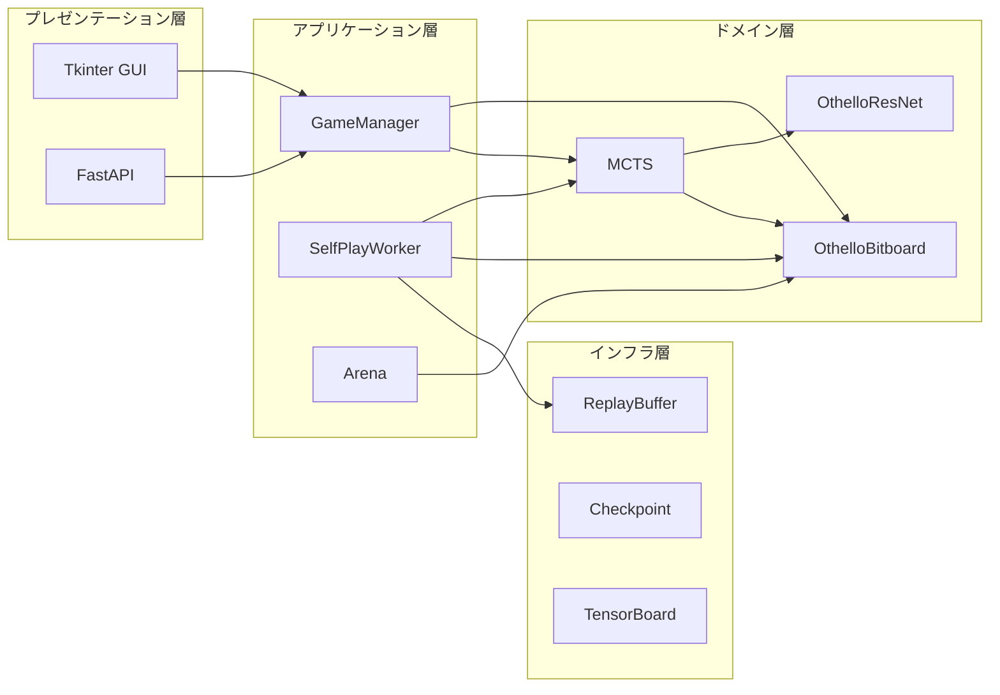
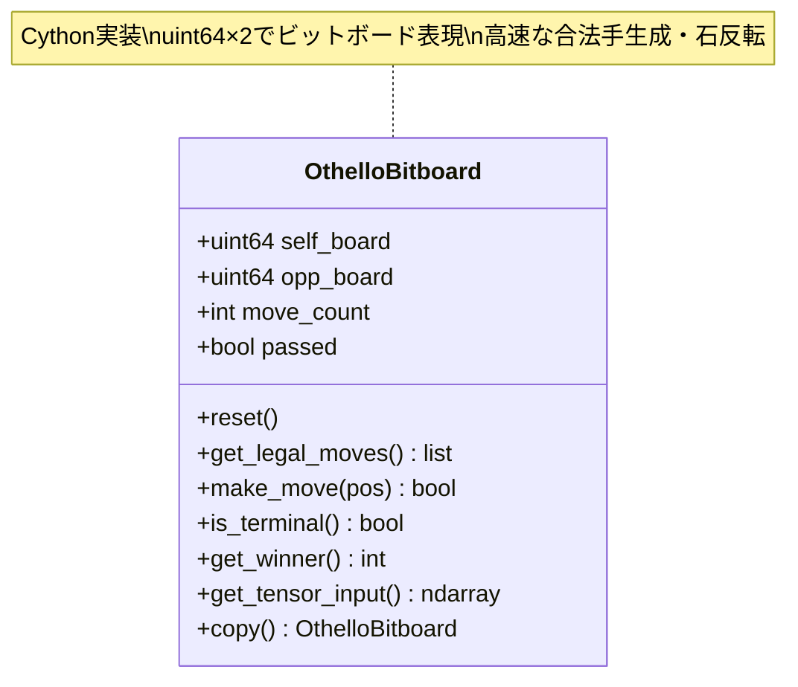
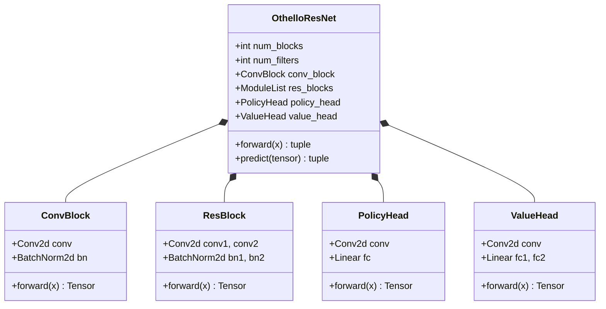
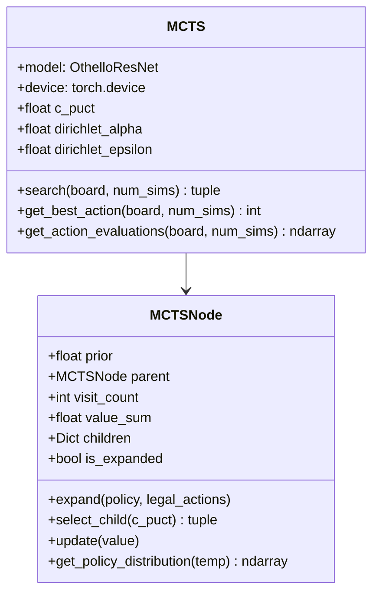
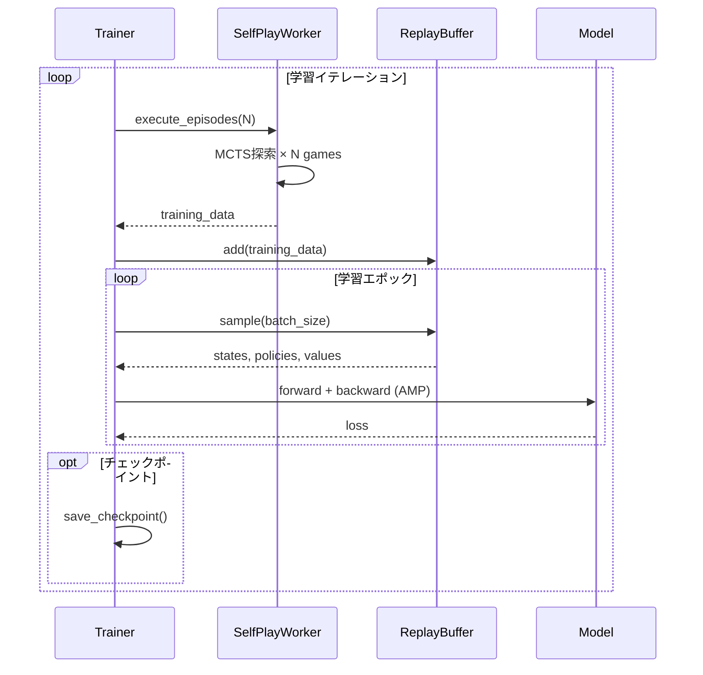
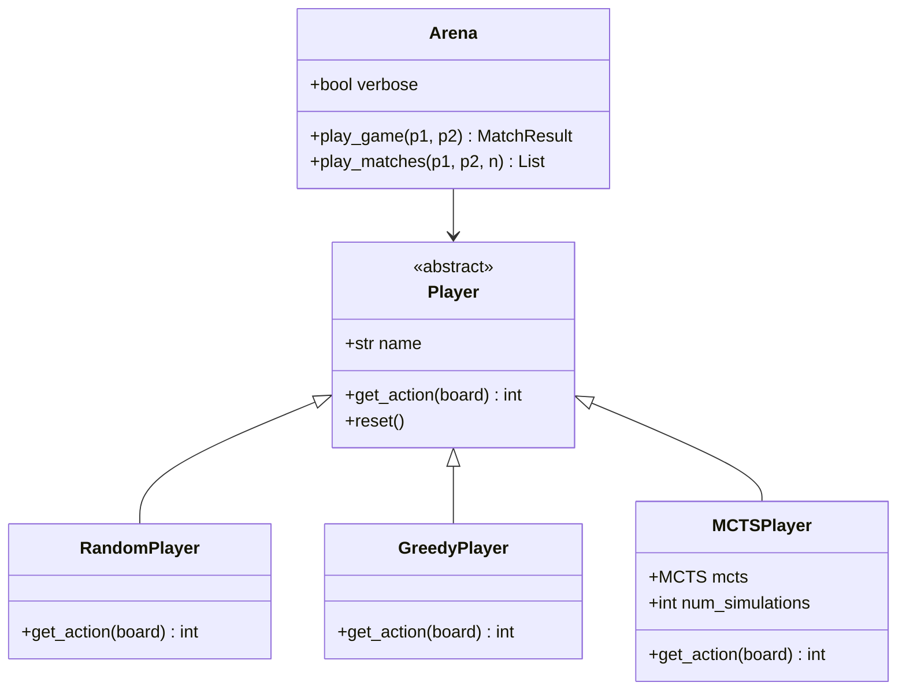
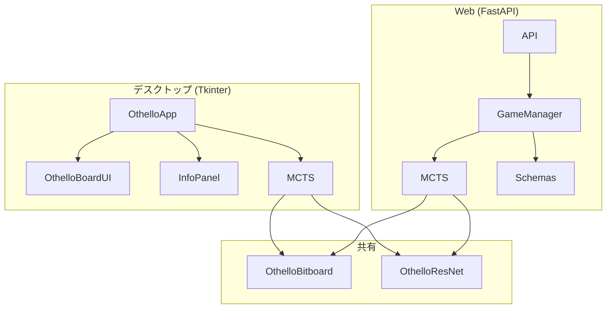

# アーキテクチャ設計書

## 概要

本システムはAlphaZero方式の強化学習を用いたオセロAIです。主要な設計原則は以下の通りです：

1. **自己対戦学習**: 人間の棋譜データに依存せず、自己対戦のみで学習
2. **GPU効率化**: RTX 4050 (6GB VRAM) 向けに混合精度学習 (AMP) を採用
3. **高速盤面処理**: Cythonによるビットボード実装で高速なゲーム進行
4. **モジュラー設計**: UI/ゲームロジック/MLパイプラインを明確に分離

## システムアーキテクチャ



## コンポーネント詳細

### 1. ゲームエンジン層



**設計判断**:
- `uint64`×2 のビットボード表現を採用（メモリ効率、ビット演算による高速化）
- 8方向の反転処理を個別メソッドで実装（デバッグ容易性）

### 2. ニューラルネットワーク層



**デフォルト構成**:
- ResBlock: 10ブロック
- フィルタ数: 128
- 入力: `(batch, 3, 8, 8)` - 自分の石/相手の石/合法手マスク
- 出力: Policy `(batch, 65)` + Value `(batch, 1)`

### 3. MCTS探索層



**PUCT式**:
```
PUCT(s,a) = Q(s,a) + c_puct × P(s,a) × √N(s) / (1 + N(s,a))
```

- `Q(s,a)`: 平均価値 = W(s,a) / N(s,a)
- `P(s,a)`: ニューラルネットワークの事前確率
- `N(s)`: 親ノードの訪問回数
- `N(s,a)`: 子ノードの訪問回数

### 4. 学習パイプライン層



**並列Self-Play**:
- `ParallelSelfPlayWorker`: 複数ゲームを同時進行
- `BatchMCTS`: NN評価をバッチ化してGPUスループット向上

### 5. 評価システム層



### 6. UI層



## データモデル

### 盤面表現

```
入力テンソル: (3, 8, 8)
├── Channel 0: 自分の石 (1=石あり, 0=なし)
├── Channel 1: 相手の石 (1=石あり, 0=なし)
└── Channel 2: 合法手マスク (1=合法, 0=不可)
```

### 学習データ

```
(state, policy, value)
├── state: ndarray (3, 8, 8) - 盤面テンソル
├── policy: ndarray (65,) - MCTS訪問回数分布
└── value: float - 最終勝敗 (+1=勝ち, -1=負け, 0=引き分け)
```

## 設計判断とトレードオフ

| 項目 | 選択 | 理由 |
|------|------|------|
| 盤面表現 | ビットボード | メモリ効率、ビット演算による高速化 |
| NN構造 | ResNet | AlphaZeroオリジナル踏襲、残差接続による安定学習 |
| 探索 | MCTS+PUCT | 探索と活用のバランス、NN価値推定との相性 |
| 学習 | SGD+Momentum | AlphaZeroオリジナル踏襲 |
| バッチサイズ | 256-512 | VRAM 6GBの制約下で調整可能 |
| AMP | 有効 | VRAM使用量削減、学習速度向上 |
