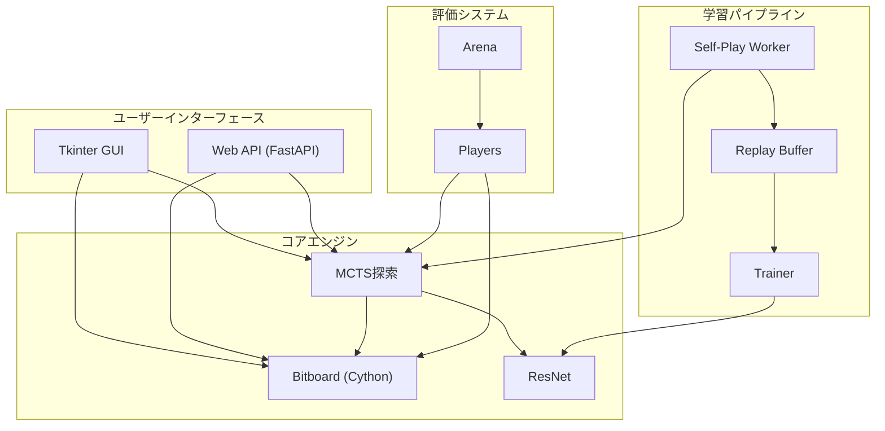
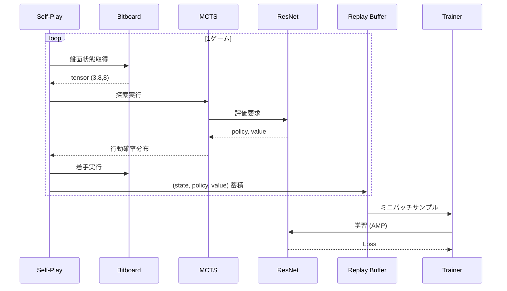

# AlphaZero オセロAI - コードドキュメント

AlphaZero方式の強化学習を用いたオセロAIシステム。自己対戦のみで学習し、人間の専門知識に依存しない強力なAIを構築します。

## システム概要

### 目的

- 人間の棋譜データに依存せず、自己対戦のみで強いオセロAIを学習
- DeepMind AlphaZeroの手法をオセロに適用
- RTX 4050 (6GB VRAM) 環境での実行を前提とした最適化

### 主要機能

| 機能 | 説明 |
|------|------|
| 自己対戦学習 | MCTS + ResNetによる強化学習 |
| 高速盤面処理 | Cython ビットボードによる高速化 |
| GUI対戦 | Tkinter/Webベースの対人・対AI対戦 |
| 評価システム | 複数プレイヤー間の対戦評価 |

## アーキテクチャ全体像



## データフロー



## モジュール構成

```
src/
├── cython/          # Cython高速化モジュール
│   └── bitboard.pyx # ビットボード盤面表現
├── model/           # ニューラルネットワーク
│   └── net.py       # ResNet (Policy + Value Head)
├── mcts/            # モンテカルロ木探索
│   ├── node.py      # MCTSノード
│   └── mcts.py      # MCTS探索アルゴリズム
├── train/           # 学習パイプライン
│   ├── buffer.py    # リプレイバッファ
│   ├── self_play.py # 自己対戦ワーカー
│   ├── parallel_self_play.py # 並列自己対戦
│   └── trainer.py   # 学習ループ
├── eval/            # 評価システム
│   ├── arena.py     # 対戦管理
│   └── players.py   # プレイヤー実装
├── gui/             # デスクトップGUI
│   ├── app.py       # アプリケーション
│   └── board_ui.py  # 盤面描画
└── web/             # Web API
    ├── api.py       # FastAPIエンドポイント
    ├── schemas.py   # Pydanticスキーマ
    └── game_manager.py # ゲーム状態管理
```

## 詳細ドキュメント

| ドキュメント | 内容 |
|-------------|------|
| [architecture.md](./architecture.md) | 詳細アーキテクチャ設計 |
| [modules/bitboard.md](./modules/bitboard.md) | ビットボード実装詳細 |
| [modules/model.md](./modules/model.md) | ResNetモデル詳細 |
| [modules/mcts.md](./modules/mcts.md) | MCTS探索詳細 |
| [modules/training.md](./modules/training.md) | 学習パイプライン詳細 |
| [modules/eval.md](./modules/eval.md) | 評価システム詳細 |
| [modules/ui.md](./modules/ui.md) | GUI/Web API詳細 |
| [api/interfaces.md](./api/interfaces.md) | 入出力定義一覧 |

## 技術スタック

| カテゴリ | 技術 |
|---------|------|
| 言語 | Python 3.11+, Cython |
| 機械学習 | PyTorch 2.0+ |
| Web | FastAPI |
| GUI | Tkinter |
| ビルド | uv, setuptools |

## ハードウェア要件

- **GPU**: NVIDIA RTX 4050 (6GB VRAM) 以上推奨
- **RAM**: 16GB以上
- 混合精度学習 (AMP) によるVRAM効率化
