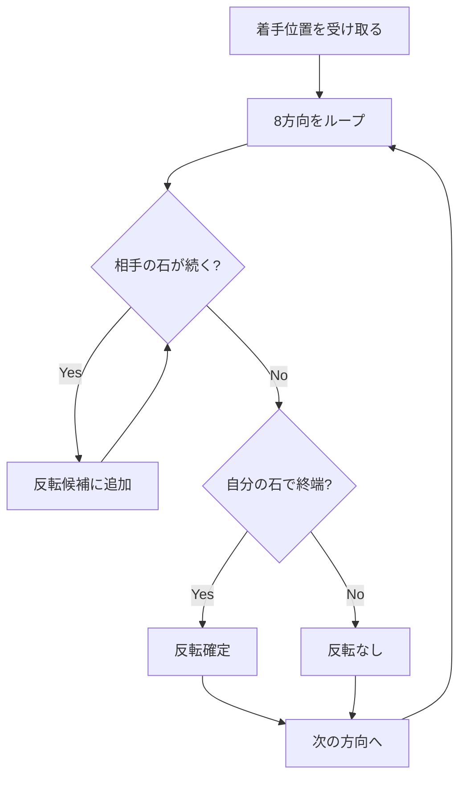
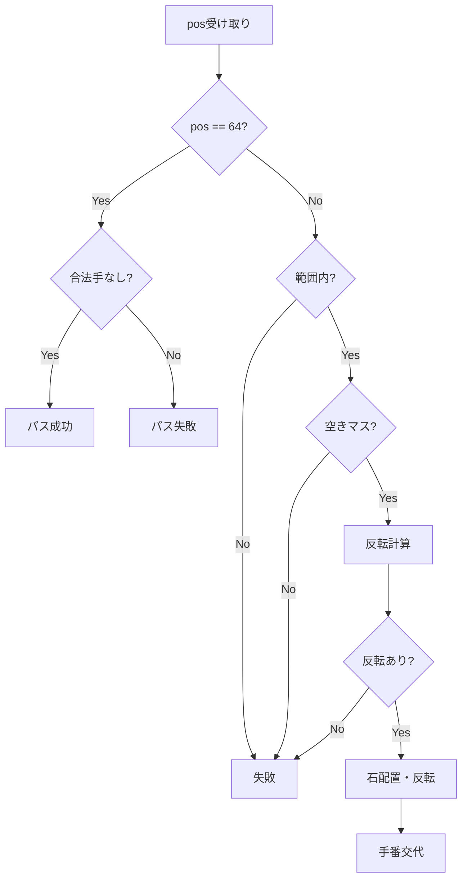

# Bitboard モジュール

`src/cython/bitboard.pyx`

## 概要

Cythonを使用した高速なオセロ盤面管理モジュール。`uint64`×2のビットボード表現により、ビット演算で合法手生成・石反転を高速に実行します。

## 処理フロー

### 盤面表現

```
ビット位置マッピング:
  A B C D E F G H
1 [ 0  1  2  3  4  5  6  7]
2 [ 8  9 10 11 12 13 14 15]
3 [16 17 18 19 20 21 22 23]
4 [24 25 26 27 28 29 30 31]
5 [32 33 34 35 36 37 38 39]
6 [40 41 42 43 44 45 46 47]
7 [48 49 50 51 52 53 54 55]
8 [56 57 58 59 60 61 62 63]
```

### 初期配置

```
初期状態:
- D4, E5: 白石 → opp_board = (1<<27) | (1<<36)
- D5, E4: 黒石 → self_board = (1<<28) | (1<<35)
- 黒（先手）から開始
```

### 石の反転処理



## クラス: OthelloBitboard

### 属性

| 属性 | 型 | 説明 |
|------|-----|------|
| `self_board` | `uint64_t` | 現在手番プレイヤーの石 |
| `opp_board` | `uint64_t` | 相手プレイヤーの石 |
| `move_count` | `int` | 現在の手数 |
| `passed` | `bool` | 前回パスしたか |

### メソッド

#### `reset()`

盤面を初期状態にリセット。

| 項目 | 内容 |
|------|------|
| 入力 | なし |
| 出力 | なし |
| 副作用 | `self_board`, `opp_board`, `move_count`, `passed` を初期化 |

#### `get_legal_moves() -> list`

合法手のリストを取得。

| 項目 | 内容 |
|------|------|
| 入力 | なし |
| 出力 | `list[int]` - 合法手のインデックス (0-63)、パスのみの場合は `[64]` |
| 処理 | 全空きマスで反転可能な石があるかチェック |

#### `make_move(pos: int) -> bool`

指定位置に着手。

| 項目 | 内容 |
|------|------|
| 入力 | `pos: int` - 着手位置 (0-63)、パスは 64 |
| 出力 | `bool` - 着手成功なら True |
| 副作用 | 石の配置・反転、手番交代、`move_count` 増加 |



#### `is_terminal() -> bool`

ゲーム終了判定。

| 項目 | 内容 |
|------|------|
| 入力 | なし |
| 出力 | `bool` - 両者とも合法手がなければ True |
| 処理 | 自分と相手の合法手をチェック |

#### `get_winner() -> int`

勝者判定（終局時のみ有効）。

| 項目 | 内容 |
|------|------|
| 入力 | なし |
| 出力 | `int` - 1=現在手番の勝ち, -1=相手の勝ち, 0=引き分け |
| 処理 | 石数を比較 |

#### `get_tensor_input() -> np.ndarray`

ニューラルネットワーク入力用のテンソルを生成。

| 項目 | 内容 |
|------|------|
| 入力 | なし |
| 出力 | `ndarray (3, 8, 8)` - float32 |

**出力チャンネル**:
- Channel 0: 自分の石
- Channel 1: 相手の石
- Channel 2: 合法手マスク

#### `copy() -> OthelloBitboard`

盤面のディープコピーを作成。

| 項目 | 内容 |
|------|------|
| 入力 | なし |
| 出力 | `OthelloBitboard` - 新しいインスタンス |

#### `get_symmetries(pi: np.ndarray) -> list`

盤面と方策の対称性を利用したデータ拡張。

| 項目 | 内容 |
|------|------|
| 入力 | `pi: ndarray (65,)` - 方策ベクトル |
| 出力 | `list[(ndarray, ndarray)]` - 8パターンの (board, pi) |
| 処理 | 4回転 × 2反転 = 8パターン生成 |

## 内部メソッド

### `_get_flip_bits(pos, self_b, opp_b) -> uint64_t`

全8方向の反転ビットを取得。

### `_get_flip_direction(pos, direction, self_b, opp_b, mask) -> uint64_t`

指定方向の反転ビットを取得。

**方向定数**:
```python
DIRECTIONS = [-8, 8, -1, 1, -9, -7, 7, 9]
# 上, 下, 左, 右, 左上, 右上, 左下, 右下
```

**端マスク**:
```python
NOT_A_FILE = 0xFEFEFEFEFEFEFEFE  # A列を除外
NOT_H_FILE = 0x7F7F7F7F7F7F7F7F  # H列を除外
```

## 使用例

```python
from src.cython.bitboard import OthelloBitboard

# 盤面作成
board = OthelloBitboard()
board.reset()

# 合法手取得
legal = board.get_legal_moves()
print(legal)  # [19, 26, 37, 44] など

# 着手
board.make_move(19)

# NN入力取得
tensor = board.get_tensor_input()
print(tensor.shape)  # (3, 8, 8)

# コピー
board_copy = board.copy()
```

## パフォーマンス特性

- 合法手生成: O(1) ビット演算
- 石反転: O(8) 各方向チェック
- 目標: 5,000-10,000 games/sec
