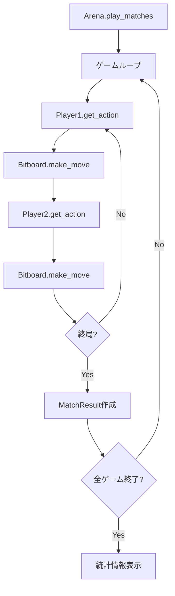
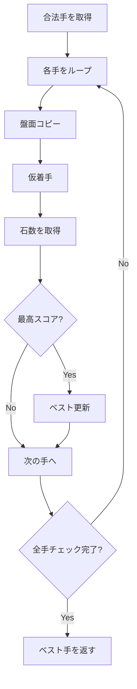

# Eval モジュール

`src/eval/arena.py`, `src/eval/players.py`

## 概要

学習したモデルの評価システム。様々なタイプのプレイヤーを対戦させ、強さを測定します。

## 処理フロー



## クラス: Player (抽象基底クラス)

すべてのプレイヤーの基底クラス。

### メソッド

#### `get_action(board) -> int`

着手を選択（抽象メソッド）。

| 項目 | 内容 |
|------|------|
| 入力 | `board: OthelloBitboard` |
| 出力 | `int` - 着手位置 (0-64) |

#### `reset()`

ゲーム開始時の初期化（オーバーライド可能）。

## プレイヤー実装

### RandomPlayer

合法手からランダムに選択。

```python
RandomPlayer(name: str = "Random")
```

**処理**:
```python
def get_action(self, board):
    legal_moves = board.get_legal_moves()
    if len(legal_moves) == 0:
        return 64  # パス
    return random.choice(legal_moves)
```

### GreedyPlayer

最も多く石を取れる（反転できる）手を選択。

```python
GreedyPlayer(name: str = "Greedy")
```

**処理フロー**:


### MCTSPlayer

学習済みモデルとMCTSを使用するAIプレイヤー。

```python
MCTSPlayer(
    model,
    device: torch.device,
    num_simulations: int = 50,
    name: str = "MCTS-AI"
)
```

#### クラスメソッド: from_checkpoint

チェックポイントからMCTSPlayerを作成。

```python
MCTSPlayer.from_checkpoint(
    checkpoint_path: str,
    device: torch.device,
    num_simulations: int = 50
) -> MCTSPlayer
```

**処理**:
1. チェックポイント読み込み
2. state_dictからモデル構成を自動検出
3. モデル作成・重み読み込み
4. MCTSPlayerを返す

### HumanPlayer

標準入力から着手を受け付ける（CLI用）。

```python
HumanPlayer(name: str = "Human")
```

**入力形式**:
- 数値 (0-63): 直接位置指定
- `row,col`: 行,列で指定

### EdaxPlayer

外部プログラムEdaxを使用（未実装、スケルトンのみ）。

```python
EdaxPlayer(
    level: int = 1,
    edax_path: str = "edax",
    name: str = None
)
```

## クラス: MatchResult

対戦結果を格納するデータクラス。

### 属性

| 属性 | 型 | 説明 |
|------|-----|------|
| `player1_name` | `str` | プレイヤー1の名前 |
| `player2_name` | `str` | プレイヤー2の名前 |
| `winner` | `int` | 勝者 (1, -1, 0) |
| `player1_score` | `int` | プレイヤー1の石数 |
| `player2_score` | `int` | プレイヤー2の石数 |
| `num_moves` | `int` | 総手数 |
| `duration` | `float` | 対戦時間（秒） |

## クラス: Arena

対戦管理システム。

### コンストラクタ

```python
Arena(verbose: bool = True)
```

### メソッド

#### `play_game(player1, player2, starting_player) -> MatchResult`

1ゲームを実行。

| 項目 | 内容 |
|------|------|
| 入力 | `player1, player2: Player`, `starting_player: int` (1 or -1) |
| 出力 | `MatchResult` |

#### `play_matches(player1, player2, num_games, alternate_colors) -> List[MatchResult]`

複数ゲームを実行。

| 項目 | 内容 |
|------|------|
| 入力 | `player1, player2: Player`, `num_games: int`, `alternate_colors: bool` |
| 出力 | `List[MatchResult]` |

**先後交代**:
- `alternate_colors=True`: 偶数ゲームはplayer1先手、奇数ゲームはplayer2先手
- `alternate_colors=False`: 常にplayer1先手

## ユーティリティ関数

### evaluate_player

プレイヤーを評価。

```python
evaluate_player(
    player: Player,
    opponent: Player,
    num_games: int = 10,
    verbose: bool = True
) -> dict
```

| 項目 | 内容 |
|------|------|
| 出力 | `{win_rate, avg_score, avg_moves, results}` |

## 使用例

```python
import torch
from src.eval.arena import Arena, evaluate_player
from src.eval.players import RandomPlayer, GreedyPlayer, MCTSPlayer

# プレイヤー作成
random_player = RandomPlayer("Random")
greedy_player = GreedyPlayer("Greedy")

# チェックポイントからMCTSプレイヤー
device = torch.device("cuda")
mcts_player = MCTSPlayer.from_checkpoint(
    "data/models/checkpoint_iter_100.pt",
    device,
    num_simulations=50
)

# 対戦
arena = Arena(verbose=True)
results = arena.play_matches(mcts_player, random_player, num_games=10)

# 勝率計算
wins = sum(1 for r in results if r.winner == 1)
print(f"MCTS win rate: {wins/len(results)*100:.1f}%")

# evaluate_player使用
eval_result = evaluate_player(mcts_player, greedy_player, num_games=20)
print(f"Win rate: {eval_result['win_rate']*100:.1f}%")
print(f"Avg score: {eval_result['avg_score']:.1f}")
```

## 評価結果の解釈

| 勝率 | 解釈 |
|------|------|
| > 90% vs Random | 基本的なゲーム理解 |
| > 70% vs Greedy | 戦略的な思考 |
| > 50% vs 前回モデル | 学習の進捗 |

## 設計判断

| 項目 | 選択 | 理由 |
|------|------|------|
| 先後交代 | デフォルト有効 | 公平な評価 |
| シミュレーション数 | 50 (評価時) | 速度と精度のバランス |
| ベースライン | Random, Greedy | 簡易な強さ測定 |
