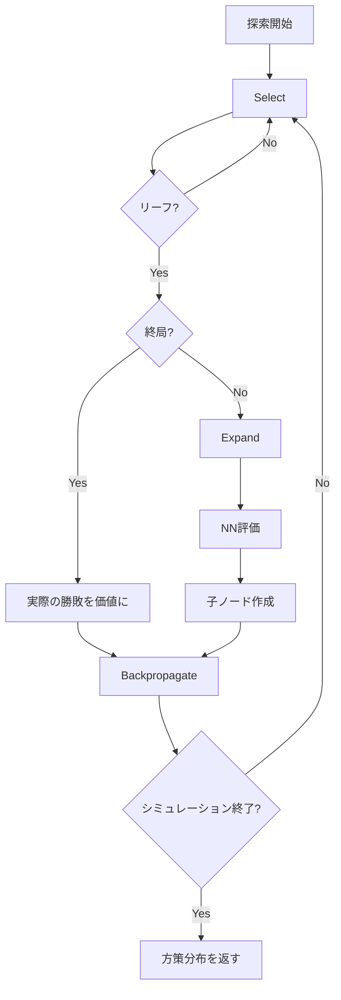
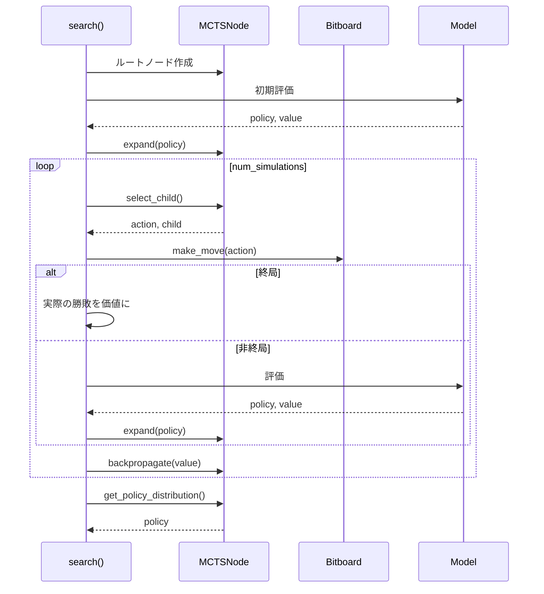

# MCTS モジュール

`src/mcts/node.py`, `src/mcts/mcts.py`

## 概要

AlphaZero方式のモンテカルロ木探索 (Monte Carlo Tree Search) 実装。ニューラルネットワークによる評価とPUCT式による選択を組み合わせ、効率的な探索を実現します。

## 処理フロー

### MCTS探索サイクル



### PUCT式による選択

```
PUCT(s,a) = Q(s,a) + c_puct × P(s,a) × √N(s) / (1 + N(s,a))
```

| 項目 | 説明 |
|------|------|
| `Q(s,a)` | 行動価値 = W(s,a) / N(s,a) |
| `P(s,a)` | 事前確率（NNの出力） |
| `N(s)` | 親ノードの訪問回数 |
| `N(s,a)` | 子ノードの訪問回数 |
| `c_puct` | 探索バランス定数（デフォルト: 1.0） |

## クラス: MCTSNode

MCTSの木構造ノード。

### 属性

| 属性 | 型 | 説明 |
|------|-----|------|
| `prior` | `float` | 事前確率 P(s,a) |
| `parent` | `MCTSNode` | 親ノード |
| `visit_count` | `int` | 訪問回数 N(s,a) |
| `value_sum` | `float` | 累積価値 W(s,a) |
| `children` | `Dict[int, MCTSNode]` | 子ノード {action: node} |
| `is_expanded` | `bool` | 展開済みフラグ |

### メソッド

#### `get_value() -> float`

平均価値 Q(s,a) を取得。

| 項目 | 内容 |
|------|------|
| 出力 | `float` - 訪問回数0なら0.0 |
| 計算 | `value_sum / visit_count` |

#### `expand(policy_probs, legal_actions)`

ノードを展開し、子ノードを作成。

| 項目 | 内容 |
|------|------|
| 入力 | `policy_probs: ndarray (65,)` - NN出力, `legal_actions: list` |
| 処理 | Action Maskingで合法手のみ確率を残す → 正規化 → 子ノード作成 |

#### `select_child(c_puct) -> tuple`

PUCT値が最大の子ノードを選択。

| 項目 | 内容 |
|------|------|
| 入力 | `c_puct: float` |
| 出力 | `(action: int, child: MCTSNode)` |

#### `update(value)`

ノードの統計情報を更新（バックプロパゲーション用）。

| 項目 | 内容 |
|------|------|
| 入力 | `value: float` - 手番視点での価値 [-1, 1] |
| 処理 | `visit_count += 1`, `value_sum += value` |

#### `get_policy_distribution(temperature) -> ndarray`

訪問回数に基づく方策分布を生成。

| 項目 | 内容 |
|------|------|
| 入力 | `temperature: float` |
| 出力 | `ndarray (65,)` |

**温度パラメータの効果**:
- `temperature = 1.0`: 訪問回数に比例した確率
- `temperature → 0`: 最大訪問回数の手に集中（決定的）
- `temperature → ∞`: 均等分布

## クラス: MCTS

MCTS探索エンジン。

### コンストラクタ

```python
MCTS(
    model,                       # OthelloResNet
    device,                      # torch.device
    c_puct: float = 1.0,        # 探索バランス定数
    dirichlet_alpha: float = 0.3,    # ディリクレノイズ
    dirichlet_epsilon: float = 0.25  # ノイズ混合比率
)
```

### メソッド

#### `search(board, num_simulations, temperature, add_dirichlet_noise) -> tuple`

MCTS探索を実行。

| 項目 | 内容 |
|------|------|
| 入力 | `board: OthelloBitboard`, `num_simulations: int`, `temperature: float`, `add_dirichlet_noise: bool` |
| 出力 | `(policy_distribution: ndarray(65,), root_value: float)` |



#### `get_best_action(board, num_simulations) -> int`

最良の行動を返す（推論用）。

| 項目 | 内容 |
|------|------|
| 入力 | `board: OthelloBitboard`, `num_simulations: int` |
| 出力 | `int` - 最良の行動 (0-64) |
| 処理 | `temperature=0` で探索 |

#### `get_action_evaluations(board, num_simulations) -> ndarray`

各合法手の評価値を取得（ヒント表示用）。

| 項目 | 内容 |
|------|------|
| 入力 | `board: OthelloBitboard`, `num_simulations: int` |
| 出力 | `ndarray (65,)` - 評価値 (0-100の整数) |
| 処理 | Q値を [0, 100] にスケーリング |

### 内部メソッド

#### `_run_simulation(node, board) -> float`

1回のシミュレーションを実行。

**処理フロー**:
1. Select: PUCT最大の子へ下降
2. Expand: リーフノードを展開
3. Backpropagate: 価値を伝播

#### `_backpropagate(path, value)`

価値をルートまで伝播。

**重要**: 手番が入れ替わるため、価値の符号を反転しながら伝播。

#### `_add_dirichlet_noise(root, legal_actions)`

ルートノードにディリクレノイズを追加。

```python
noise = np.random.dirichlet([alpha] * num_actions)
prior = (1 - epsilon) * prior + epsilon * noise
```

## 使用例

```python
import torch
from src.mcts.mcts import MCTS
from src.model.net import OthelloResNet
from src.cython.bitboard import OthelloBitboard

# セットアップ
device = torch.device("cuda")
model = OthelloResNet().to(device)
model.eval()

mcts = MCTS(model, device, c_puct=1.0)

# 盤面
board = OthelloBitboard()
board.reset()

# 探索
policy, value = mcts.search(
    board,
    num_simulations=50,
    temperature=1.0,
    add_dirichlet_noise=True
)

# 最良手を取得
best_action = mcts.get_best_action(board, num_simulations=50)
print(f"Best action: {best_action}")

# ヒント取得
evaluations = mcts.get_action_evaluations(board, num_simulations=25)
for pos in board.get_legal_moves():
    if pos < 64:
        print(f"Position {pos}: {evaluations[pos]}")
```

## 設計判断

| 項目 | 選択 | 理由 |
|------|------|------|
| 探索定数 c_puct | 1.0 | AlphaZeroオリジナル値 |
| ディリクレα | 0.3 | オセロの分岐数に適合 |
| ディリクレε | 0.25 | 探索多様性のバランス |
| Action Masking | 合法手のみ | 不要な探索の削減 |
