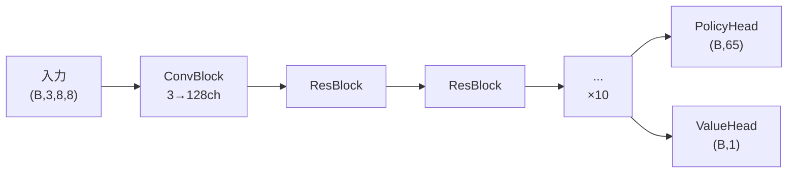

# Model モジュール

`src/model/net.py`

## 概要

AlphaZero方式のDual-Head ResNetモデル。盤面状態から方策（次の手の確率分布）と価値（勝率推定）を同時に出力します。

## 処理フロー



## ネットワーク構造

### 入力形式

```
shape: (Batch, 3, 8, 8)
├── Channel 0: 自分の石 (1=あり, 0=なし)
├── Channel 1: 相手の石 (1=あり, 0=なし)
└── Channel 2: 合法手マスク (1=合法, 0=不可)
```

### 出力形式

```
Policy: (Batch, 65) - Log確率分布
├── Index 0-63: 盤面位置
└── Index 64: パスアクション

Value: (Batch, 1) - スカラ値 [-1, 1]
├── +1: 現在手番の勝ち
├── -1: 現在手番の負け
└──  0: 引き分け
```

## クラス詳細

### OthelloResNet

メインモデルクラス。

#### コンストラクタ

```python
OthelloResNet(
    num_blocks: int = 10,    # ResBlockの数
    num_filters: int = 128,  # フィルタ数
    board_size: int = 8      # 盤面サイズ
)
```

#### forward

| 項目 | 内容 |
|------|------|
| 入力 | `x: Tensor (Batch, 3, 8, 8)` |
| 出力 | `Tuple[Tensor, Tensor]` - (policy_logits, value) |

```python
def forward(self, x):
    x = self.conv_block(x)           # (B, 128, 8, 8)
    for res_block in self.res_blocks:
        x = res_block(x)             # (B, 128, 8, 8)
    policy_logits = self.policy_head(x)  # (B, 65)
    value = self.value_head(x)           # (B, 1)
    return policy_logits, value
```

#### predict

推論用ヘルパーメソッド。

| 項目 | 内容 |
|------|------|
| 入力 | `board_tensor: Tensor (3,8,8) or (B,3,8,8)` |
| 出力 | `Tuple[Tensor, Tensor]` - (policy_probs, value) |
| 処理 | eval()モード、no_grad()で推論 |

### ConvBlock

初期畳み込みブロック。

```
Conv2d(3→128, kernel=3, padding=1) → BatchNorm2d → ReLU
```

| 項目 | 内容 |
|------|------|
| 入力 | `(Batch, 3, 8, 8)` |
| 出力 | `(Batch, 128, 8, 8)` |

### ResBlock

残差ブロック。

```
Input ─┬─→ Conv3x3 → BN → ReLU → Conv3x3 → BN ─┬─→ ReLU → Output
       └────────────────────────────────────────┘
                     (Skip Connection)
```

| 項目 | 内容 |
|------|------|
| 入力 | `(Batch, 128, 8, 8)` |
| 出力 | `(Batch, 128, 8, 8)` |

### PolicyHead

方策ヘッド。

```
Conv2d(128→2, kernel=1) → BN → ReLU → Flatten → Linear(128→65) → LogSoftmax
```

| 項目 | 内容 |
|------|------|
| 入力 | `(Batch, 128, 8, 8)` |
| 出力 | `(Batch, 65)` - Log確率 |

### ValueHead

価値ヘッド。

```
Conv2d(128→1, kernel=1) → BN → ReLU → Flatten → Linear(64→256) → ReLU → Linear(256→1) → Tanh
```

| 項目 | 内容 |
|------|------|
| 入力 | `(Batch, 128, 8, 8)` |
| 出力 | `(Batch, 1)` - 値域 [-1, 1] |

## ファクトリ関数

### create_model

設定ファイルからモデルを作成。

```python
def create_model(config: dict) -> OthelloResNet:
    """
    Args:
        config: {"num_blocks": 10, "num_filters": 128, "board_size": 8}

    Returns:
        OthelloResNet インスタンス
    """
```

## パラメータ数

デフォルト構成 (10ブロック, 128フィルタ) の場合:
- 総パラメータ: 約 1.7M
- 学習可能パラメータ: 約 1.7M

## 使用例

```python
import torch
from src.model.net import OthelloResNet, create_model

# 直接作成
model = OthelloResNet(num_blocks=10, num_filters=128)

# 設定から作成
config = {"num_blocks": 5, "num_filters": 64}
model = create_model(config)

# 推論
device = torch.device("cuda")
model.to(device)
model.eval()

# 入力テンソル
x = torch.randn(1, 3, 8, 8).to(device)

# forward
policy_logits, value = model(x)
print(policy_logits.shape)  # (1, 65)
print(value.shape)          # (1, 1)

# predict (便利メソッド)
policy_probs, value = model.predict(x)
print(policy_probs.shape)   # (65,) - 確率に変換済み

# パラメータ数確認
params = model.get_param_count()
print(f"Total: {params['total']:,}")
print(f"Trainable: {params['trainable']:,}")
```

## 設計判断

| 項目 | 選択 | 理由 |
|------|------|------|
| 活性化関数 | ReLU | 安定性、計算効率 |
| 正規化 | BatchNorm | 学習安定化 |
| 出力活性化 | LogSoftmax + Tanh | Policy: 確率分布, Value: 範囲制約 |
| バイアス | なし (Conv) | BatchNormとの組み合わせで不要 |
