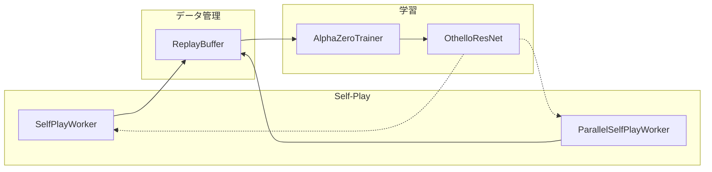
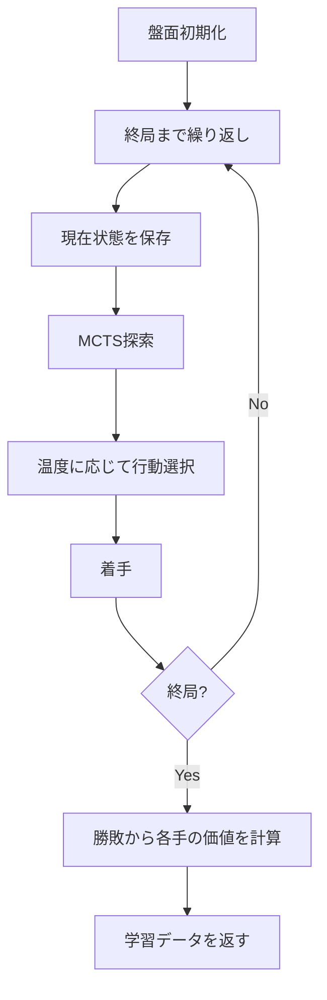
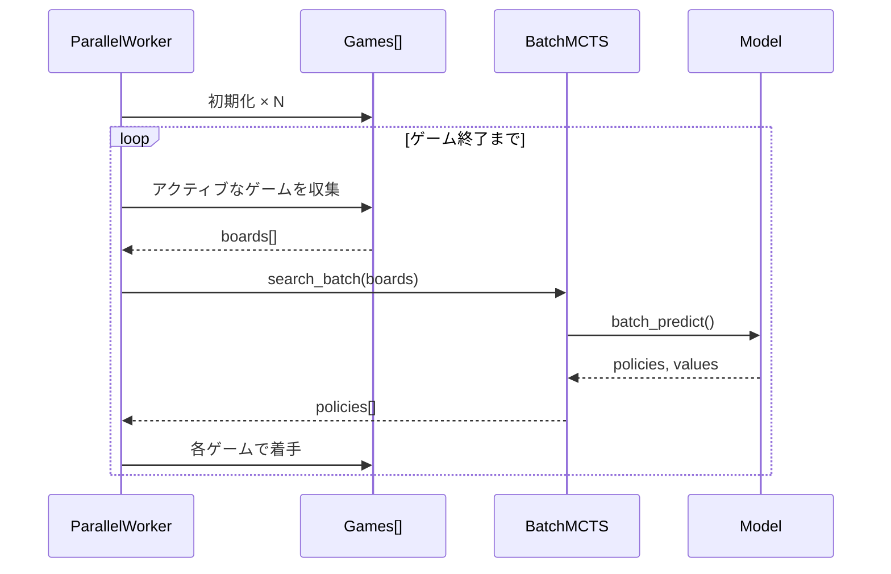
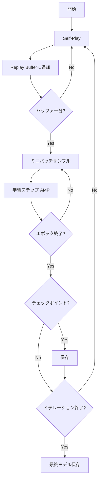

# Training モジュール

`src/train/buffer.py`, `src/train/self_play.py`, `src/train/parallel_self_play.py`, `src/train/trainer.py`

## 概要

AlphaZeroの学習パイプラインを実装。Self-Play → Replay Buffer → Train のサイクルで自己対戦学習を行います。

## 処理フロー



## クラス: ReplayBuffer

学習データを効率的に管理するリングバッファ。

### コンストラクタ

```python
ReplayBuffer(max_size: int = 100000)
```

### メソッド

#### `add(data)`

複数のデータをバッファに追加。

| 項目 | 内容 |
|------|------|
| 入力 | `List[(state, policy, value)]` |
| 処理 | 古いデータは自動的に破棄される |

**データ形式**:
```
state: ndarray (3, 8, 8) - 盤面テンソル
policy: ndarray (65,) - MCTS訪問回数分布
value: float - 勝敗 (+1, -1, 0)
```

#### `sample(batch_size) -> tuple`

ランダムサンプリングでミニバッチを生成。

| 項目 | 内容 |
|------|------|
| 入力 | `batch_size: int` |
| 出力 | `(states, policies, values)` |
| 出力形状 | `(B,3,8,8)`, `(B,65)`, `(B,1)` |

#### `is_ready(min_size) -> bool`

学習可能な状態かチェック。

| 項目 | 内容 |
|------|------|
| 入力 | `min_size: int` |
| 出力 | `bool` - バッファサイズ >= min_size |

#### `get_statistics() -> dict`

バッファの統計情報を取得。

| 項目 | 内容 |
|------|------|
| 出力 | `{size, max_size, fill_rate, value_mean, value_std}` |

## クラス: SelfPlayWorker

MCTSを使って自己対戦を行い、学習データを生成。

### コンストラクタ

```python
SelfPlayWorker(
    board_class,              # OthelloBitboard
    mcts,                     # MCTS
    num_simulations: int = 25,
    temperature_threshold: int = 15
)
```

### メソッド

#### `execute_episode(add_dirichlet_noise) -> List`

1エピソード（1ゲーム）を実行。

| 項目 | 内容 |
|------|------|
| 入力 | `add_dirichlet_noise: bool` |
| 出力 | `List[(state, policy, value)]` |

**処理フロー**:


**温度パラメータ**:
- 序盤 (< threshold): `temperature = 1.0` (確率的選択)
- 終盤 (>= threshold): `temperature = 0.0` (決定的選択)

#### `execute_episodes(num_episodes, add_dirichlet_noise) -> List`

複数エピソードを実行。

| 項目 | 内容 |
|------|------|
| 入力 | `num_episodes: int`, `add_dirichlet_noise: bool` |
| 出力 | `List[(state, policy, value)]` - 全エピソードのデータ |

## クラス: ParallelSelfPlayWorker

複数ゲームを同時進行し、バッチ推論でGPUスループットを最大化。

### コンストラクタ

```python
ParallelSelfPlayWorker(
    board_class,
    model,
    device,
    num_simulations: int = 25,
    temperature_threshold: int = 15,
    num_parallel_games: int = 8,
    c_puct: float = 1.0,
    dirichlet_alpha: float = 0.3,
    dirichlet_epsilon: float = 0.25
)
```

### メソッド

#### `execute_episodes(num_episodes, add_dirichlet_noise) -> List`

複数エピソードを並列実行。

| 項目 | 内容 |
|------|------|
| 入力 | `num_episodes: int`, `add_dirichlet_noise: bool` |
| 出力 | `List[(state, policy, value)]` |

**高速化のポイント**:
1. 複数ゲームを同時進行
2. MCTSのリーフノード評価をバッチ化
3. GPUの並列処理能力を活用



## クラス: BatchMCTS

バッチ推論対応のMCTS。

### メソッド

#### `batch_predict(boards) -> tuple`

複数の盤面をバッチ評価。

| 項目 | 内容 |
|------|------|
| 入力 | `boards: List[OthelloBitboard]` |
| 出力 | `(policies: ndarray, values: ndarray)` |

#### `search_batch(boards, num_simulations, ...) -> List`

複数の盤面に対してMCTS探索を実行。

| 項目 | 内容 |
|------|------|
| 入力 | `boards: List`, `num_simulations: int`, etc. |
| 出力 | `List[(policy, value)]` |

## クラス: AlphaZeroTrainer

学習ループ全体のオーケストレーション。

### コンストラクタ

```python
AlphaZeroTrainer(
    model: nn.Module,
    device: torch.device,
    replay_buffer,
    self_play_worker,
    config: dict,
    checkpoint_dir: str = "data/models",
    log_dir: str = "data/logs"
)
```

### メソッド

#### `train(...)`

学習ループを実行。

| 項目 | 内容 |
|------|------|
| 入力 | `num_iterations`, `self_play_episodes_per_iter`, `train_epochs_per_iter`, `batch_size`, `checkpoint_interval` |

**学習ループ**:


**損失関数**:
- **Policy Loss**: クロスエントロピー `-Σ target × log(pred)`
- **Value Loss**: MSE `(pred - target)²`
- **Total Loss**: Policy Loss + Value Loss

#### `save_checkpoint(filename)`

チェックポイントを保存。

| 項目 | 内容 |
|------|------|
| 保存内容 | model_state_dict, optimizer_state_dict, scheduler_state_dict, global_step, epoch, config |

#### `load_checkpoint(checkpoint_path)`

チェックポイントを読み込み。

## 使用例

```python
import torch
from src.cython.bitboard import OthelloBitboard
from src.model.net import OthelloResNet
from src.mcts.mcts import MCTS
from src.train.buffer import ReplayBuffer
from src.train.self_play import SelfPlayWorker
from src.train.trainer import AlphaZeroTrainer

# セットアップ
device = torch.device("cuda")
model = OthelloResNet().to(device)
mcts = MCTS(model, device)

# Self-Playワーカー
worker = SelfPlayWorker(
    board_class=OthelloBitboard,
    mcts=mcts,
    num_simulations=25
)

# リプレイバッファ
buffer = ReplayBuffer(max_size=100000)

# トレーナー
config = {
    "lr": 0.001,
    "momentum": 0.9,
    "weight_decay": 0.0001
}

trainer = AlphaZeroTrainer(
    model=model,
    device=device,
    replay_buffer=buffer,
    self_play_worker=worker,
    config=config
)

# 学習開始
trainer.train(
    num_iterations=100,
    self_play_episodes_per_iter=100,
    train_epochs_per_iter=10,
    batch_size=256,
    checkpoint_interval=10
)
```

## 設計判断

| 項目 | 選択 | 理由 |
|------|------|------|
| オプティマイザ | SGD + Momentum | AlphaZeroオリジナル |
| バッチサイズ | 256-512 | VRAM 6GBの制約 |
| AMP | 有効 | VRAM効率、速度向上 |
| 温度閾値 | 15手 | 序盤の探索多様性確保 |
