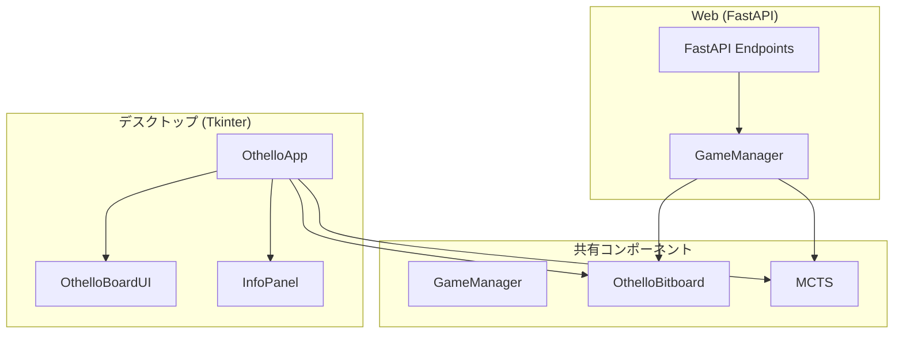
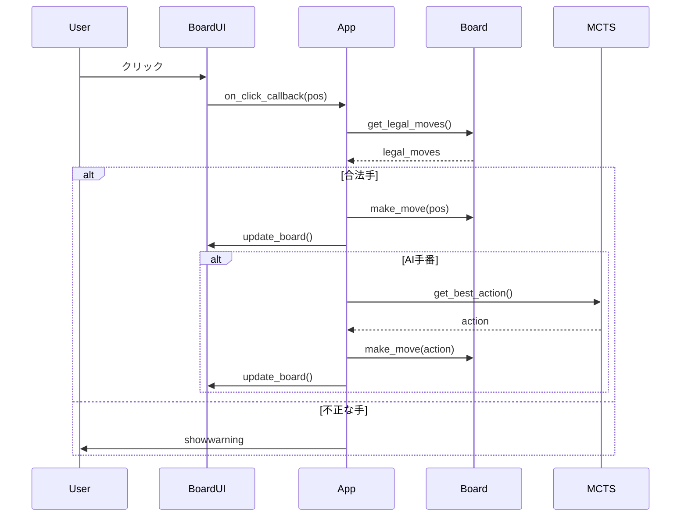
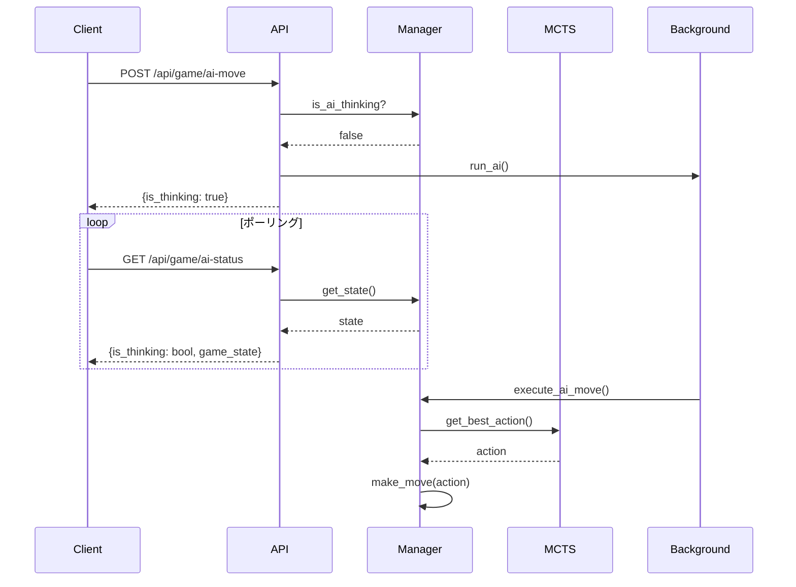

# UI モジュール

`src/gui/app.py`, `src/gui/board_ui.py`, `src/web/api.py`, `src/web/schemas.py`, `src/web/game_manager.py`

## 概要

オセロAIのユーザーインターフェース。デスクトップ版（Tkinter）とWeb版（FastAPI）の2種類を提供します。

## アーキテクチャ



## デスクトップ版 (Tkinter)

### クラス: OthelloApp

メインアプリケーションクラス。

#### コンストラクタ

```python
OthelloApp(
    root: tk.Tk,
    model_path: Optional[str] = None
)
```

#### 主要機能

| 機能 | メソッド | 説明 |
|------|----------|------|
| 新規ゲーム | `new_game()` | 盤面リセット |
| 待った | `undo_move()` | 1手戻す |
| AI着手 | `ai_move()` | AIに着手させる |
| ヒント | `_toggle_hint()` | 評価値表示切替 |
| モデル読込 | `load_model(path)` | チェックポイント読込 |

#### GUI構成

```
+------------------------------------------+
|  [File] [Game] [Help]                    | メニューバー
+------------------------------------------+
|  +------------------+ +----------------+ |
|  |                  | |  Turn: Black   | |
|  |                  | |  Black: 2      | |
|  |    8x8 盤面      | |  White: 2      | |
|  |                  | |  [New Game]    | |
|  |                  | |  [Undo]        | |
|  |                  | |  [AI Move]     | |
|  |                  | |  [Hint]        | |
|  +------------------+ |  Simulations:  | |
|                       |  [====50====]  | |
|                       +----------------+ |
+------------------------------------------+
```

### クラス: OthelloBoardUI

盤面描画用Canvasウィジェット。

#### コンストラクタ

```python
OthelloBoardUI(
    parent,
    board_size: int = 8,
    cell_size: int = 60,
    on_click_callback: Optional[Callable[[int], None]] = None
)
```

#### メソッド

| メソッド | 説明 |
|----------|------|
| `update_board(board_state, legal_moves)` | 盤面更新 |
| `show_evaluations(evaluation)` | 評価値表示ON |
| `hide_evaluations()` | 評価値表示OFF |
| `toggle_evaluation()` | 表示切替 |

#### 表示仕様

| 要素 | 色 | 説明 |
|------|-----|------|
| 盤面背景 | `#006400` (深緑) | オセロ盤 |
| 黒石 | `black` | 黒プレイヤーの石 |
| 白石 | `white` | 白プレイヤーの石 |
| 合法手ヒント | `#90EE90` (ライトグリーン) | 着手可能マス |
| 評価値(高) | `#00FF00` (緑) | 60以上 |
| 評価値(中) | `#FFFF00` (黄) | 40-59 |
| 評価値(低) | `#FF6600` (オレンジ) | 39以下 |

### クラス: InfoPanel

ゲーム情報表示パネル。

#### メソッド

| メソッド | 説明 |
|----------|------|
| `update_turn(player)` | 手番表示更新 |
| `update_scores(black, white)` | 石数更新 |
| `set_message(msg, color)` | ステータスメッセージ |

## Web版 (FastAPI)

### クラス: GameManager

Webインターフェース向けゲーム状態管理。OthelloAppからゲームロジックを抽出し、Tkinter非依存で実装。

#### メソッド

| メソッド | 説明 |
|----------|------|
| `new_game(mode)` | 新規ゲーム開始 |
| `make_move(position)` | 着手実行 |
| `undo()` | 一手戻す |
| `execute_ai_move()` | AI着手 |
| `get_hint_evaluations()` | ヒント取得 |
| `load_model(path)` | モデル読込 |
| `get_state()` | 現在状態取得 |

### APIエンドポイント

#### ゲーム操作

| エンドポイント | メソッド | 説明 |
|----------------|----------|------|
| `/api/game/new` | POST | 新規ゲーム |
| `/api/game/state` | GET | 状態取得 |
| `/api/game/move` | POST | 着手 |
| `/api/game/undo` | POST | 待った |
| `/api/game/ai-move` | POST | AI着手（非同期） |
| `/api/game/ai-status` | GET | AI思考状態確認 |
| `/api/game/hint` | GET | ヒント取得 |

#### AI設定

| エンドポイント | メソッド | 説明 |
|----------------|----------|------|
| `/api/ai/load-model` | POST | モデル読込 |
| `/api/ai/simulations` | PUT | シミュレーション数設定 |
| `/api/ai/simulations` | GET | 現在の設定取得 |
| `/api/ai/models` | GET | モデル一覧 |

### Pydanticスキーマ

#### リクエスト

```python
class NewGameRequest(BaseModel):
    mode: str = "human_vs_ai"

class MoveRequest(BaseModel):
    position: int  # 0-64

class LoadModelRequest(BaseModel):
    model_path: str

class SimulationsRequest(BaseModel):
    count: int  # 10-500
```

#### レスポンス

```python
class GameState(BaseModel):
    board: List[List[int]]      # 8x8盤面
    legal_moves: List[int]      # 合法手
    current_player: int         # 1=黒, -1=白
    black_count: int
    white_count: int
    is_terminal: bool
    winner: Optional[int]
    is_ai_thinking: bool
    move_count: int
    message: Optional[str]
    model_loaded: bool

class MoveResponse(BaseModel):
    success: bool
    game_state: GameState
    error: Optional[str]

class HintResponse(BaseModel):
    evaluations: Dict[int, int]  # {position: 0-100}
    success: bool
    error: Optional[str]
```

## 処理フロー

### デスクトップ版: 着手フロー



### Web版: AI着手フロー



## 使用例

### デスクトップ版

```python
import tkinter as tk
from src.gui.app import OthelloApp

root = tk.Tk()
app = OthelloApp(root, model_path="data/models/final_model.pt")
app.run()
```

### Web版起動

```bash
uvicorn src.web.api:app --reload --port 8000
```

### API呼び出し例

```python
import requests

# 新規ゲーム
resp = requests.post("http://localhost:8000/api/game/new", json={"mode": "human_vs_ai"})

# 着手
resp = requests.post("http://localhost:8000/api/game/move", json={"position": 19})

# ヒント取得
resp = requests.get("http://localhost:8000/api/game/hint")
print(resp.json()["evaluations"])
```

## 設計判断

| 項目 | 選択 | 理由 |
|------|------|------|
| デスクトップUI | Tkinter | 標準ライブラリ、クロスプラットフォーム |
| Web API | FastAPI | 非同期対応、自動ドキュメント |
| AI処理 | バックグラウンド | UIブロッキング回避 |
| 状態管理 | GameManager共通化 | コード重複削減 |
