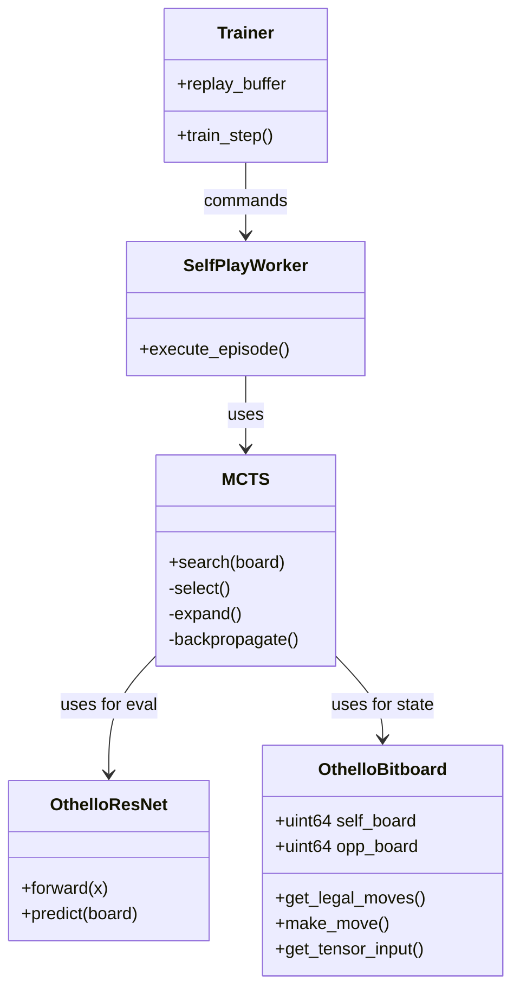

# オセロAI開発 内部設計書

## 1. ディレクトリ構成

標準的な機械学習プロジェクト構成を採用し、Cython拡張モジュールを明確に分離します。

```text
othello_alphazero/
├── configs/                # 設定ファイル (YAML)
│   ├── default_8x8.yaml
│   └── debug_6x6.yaml
├── data/                   # 学習データ・ログ保存先
│   ├── logs/               # TensorBoardログ
│   └── models/             # 学習済みモデル (.pt, .onnx)
├── src/
│   ├── __init__.py
│   ├── cython/             # 高速化モジュール (Cython)
│   │   ├── bitboard.pyx    # ビットボード実装本体
│   │   ├── bitboard.pxd    # ヘッダ定義
│   │   └── setup.py        # ビルドスクリプト
│   ├── model/              # ニューラルネットワーク定義
│   │   ├── net.py          # ResNetアーキテクチャ
│   │   └── utils.py        # モデル変換ユーティリティ
│   ├── mcts/               # 探索アルゴリズム
│   │   ├── mcts.py         # MCTSロジック
│   │   └── node.py         # 木構造ノード定義
│   ├── train/              # 学習ループ関連
│   │   ├── self_play.py    # 自己対戦ワーカー
│   │   ├── trainer.py      # パラメータ更新ロジック
│   │   └── buffer.py       # リプレイバッファ
│   ├── gui/                # GUIアプリケーション
│   │   ├── app.py          # メインウィンドウ
│   │   └── board_ui.py     # 盤面描画コンポーネント
│   └── utils/
│       └── logger.py       # ログ出力共通化
├── tests/                  # 単体テスト
├── main.py                 # CLIエントリポイント (学習・評価用)
└── run_gui.py              # GUIエントリポイント
```

---

## 2. モジュール詳細設計

### 2.1 コア・ゲームロジック (Cython)

**ファイル:** `src/cython/bitboard.pyx`
Pythonのオーバーヘッドを回避するため、盤面管理と合法手生成はC言語レベルで動作させます。

**クラス: `OthelloBitboard`**

| メンバ変数/メソッド | 型/シグネチャ | 説明 |
| :--- | :--- | :--- |
| `self_board` | `uint64` | 自分の石のビット配置 |
| `opp_board` | `uint64` | 相手の石のビット配置 |
| `move_count` | `int` | 現在の手数 |
| `reset()` | `void` | 盤面を初期状態に戻す |
| `get_legal_moves()` | `list[int]` | 合法手のインデックス(0-63)リストを返す |
| `make_move(pos)` | `void` | 指定位置に着手し、石を反転させ、手番を入れ替える |
| `is_terminal()` | `bool` | 終局かどうか判定 |
| `get_winner()` | `int` | 1:自分勝, -1:相手勝, 0:引分 |
| `get_tensor_input()` | `np.ndarray` | NN入力用 (3, 8, 8) 配列を生成して返す |
| `get_symmetries()` | `list` | 盤面を回転・反転させた8パターンのリストを返す |

**実装のポイント:**

* `cdef` を用いて内部ロジックは型付けされたC変数として扱う。
* Pythonから呼ぶメソッドのみ `def` または `cpdef` で公開する。

### 2.2 ニューラルネットワーク (PyTorch)

**ファイル:** `src/model/net.py`
RTX 4050向けに最適化したResNetモデルを定義します。

**クラス: `OthelloResNet(nn.Module)`**

* **`__init__(self, num_blocks=10, num_filters=128)`**
  * コンストラクタ引数でモデル規模を可変にする（実験効率化のため）。
* **構造:**
  * `ConvBlock`: 入力(3ch) → 128ch へ畳み込み + BN + ReLU
  * `ResBlock` x `num_blocks`:
    * Conv(3x3) -> BN -> ReLU -> Conv(3x3) -> BN -> Add Skip -> ReLU
  * `PolicyHead`:
    * Conv(1x1, 2ch) -> BN -> ReLU -> FC -> LogSoftmax(65)
  * `ValueHead`:
    * Conv(1x1, 1ch) -> BN -> ReLU -> FC(256) -> ReLU -> FC(1) -> Tanh

### 2.3 モンテカルロ木探索 (MCTS)

**ファイル:** `src/mcts/mcts.py`

**クラス: `MCTS`**

* **主要メソッド:**
  * `search(board, num_simulations, temperature)`:
    * 指定回数シミュレーションを行い、訪問回数に基づく確率分布 $\pi$ を返す。
    * `temperature` に応じて確率的選択か、最大値選択かを切り替える。
  * `run_simulation(root_node)`:
    * Select → Expand & Evaluate (NN推論) → Backpropagate の1サイクルを実行。
    * **Action Masking:** NNの出力確率に対し、`bitboard.get_legal_moves()` に含まれない手の確率をゼロにする処理をここで行う。

### 2.4 学習管理 (Training Loop)

**ファイル:** `src/train/trainer.py`

**クラス: `AlphaZeroTrainer`**

* **役割:** 全体のオーケストレーションを行う。
* **処理フロー:**
    1. `SelfPlayWorker` を並列(または直列)で走らせ、ゲームデータをバッファに貯める。
    2. バッファからミニバッチを取り出す。
    3. `torch.cuda.amp.GradScaler` を用いて混合精度でバックプロパゲーションを行う（VRAM節約）。
    4. 一定エポックごとにチェックポイント保存と評価（Evaluation）を行う。

---

## 3. データ構造設計

### 3.1 学習サンプル (Training Sample)

リプレイバッファに格納される1要素のデータ形式。

```python
class GameStep:
    state: np.ndarray       # (3, 8, 8) - NN入力テンソル
    pi: np.ndarray          # (65,)     - MCTS訪問回数分布（ターゲット方針）
    z: int                  # 1 or -1   - 最終的な勝敗（手番視点）
```

### 3.2 設定ファイル (Config YAML)

`configs/default_8x8.yaml` の例。

```yaml
game:
  size: 8
  
model:
  num_blocks: 10
  num_filters: 128

training:
  batch_size: 256        # RTX 4050なら256-512程度
  lr: 0.001
  weight_decay: 0.0001
  momentum: 0.9

mcts:
  num_simulations: 25    # 学習時は少なめで高速化
  c_puct: 1.0            # 探索のバランス定数
  dirichlet_alpha: 0.3
```

---

## 4. クラス図 (概念)



---

## 5. 実装の優先順位と検証手順

内部設計に基づき、以下の順序で実装を進めることを推奨します。

1. **Cython Bitboardの実装:** `src/cython/bitboard.pyx` を書き、`setup.py` でビルドできる環境を作る。ランダムな手で10万局対戦させ、速度（例: 10,000 games/sec）が出るか確認する。
2. **NNの実装:** PyTorchでResNetを定義し、ダミー入力で出力次元が正しいか、GPUで動作するか確認する。
3. **MCTSと統合:** 未学習のNN（ランダムな重み）を使ってMCTSが動作し、ゲームが進行することを確認する。
4. **学習ループの結合:** 自己対戦→学習→モデル更新のサイクルがエラーなく1周することを確認する。
